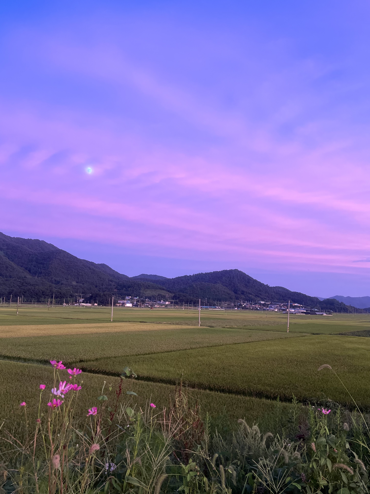

## About Me 👋  
안녕하세요! 장시현입니다.  
익숙함에 안주하기보다, 도전하는 선택을 선호합니다.  
풀 스택 개발자를 목표로 성장 중입니다.

## Final Vocabulary : 실용성
개발의 본질은 사용자의 불편을 해결하는 데 있다고 믿고,
작은 변화라도 사용 경험을 매끄럽게 만드는 코드를 지향합니다.

## History
     2023. 03 ~ 한양대학교 정보시스템학과 Hanyang University Information System 
     2023. 03 ~ 2024. 12 정보시스템학과 학생회 사무국장
     2024. 08 ~ 금융감독원 FSS 대학생 금융교육 봉사단 12기
     2024. 12 ~ 정보시스템학과 감사위원회 선임위원
     2025. 12 ~ 신한투자증권 프로 디지털 아카데미 7기

## Awards
     2025. 12 Excellence Award(2nd Place), LG Electronics Hanyang University IC-PBL Project

## Skill

- Programming languages:

- Frontend:

- DB:

- Cooperation:

## project

### HomeQuest
> **IoT 데이터를 기반으로 가족의 생활 습관 변화를 유도하는  
> 가족 참여형 AI 스마트홈 서비스**  
>   *한양대학교 IC-PBL × LG전자 산학협력 프로젝트*

#### Links
- **GitHub**: https://github.com/CSE-HOMEQUEST  
- **Demo**: https://www.youtube.com/watch?v=wRn-Hax9f6s
- **Notion**: https://pinto-shovel-744.notion.site/HomeQuest-2b18ad1b8bdf80679a09d64a73448f45?source=copy_link 

#### Key Features
- 가전 사용 로그·사용자 행동 데이터 기반 개인 맞춤형 챌린지 추천
- 챌린지 수행 내역 및 포인트 변화를 랭킹, 마켓에 실시간 반영하는 보상 구조
- 활동 로그가 OPEN API에 전달되어 가족별 AI 주간 리포트 제공

 

## Hobby

  
  

  
  

# Interest
- Cloud Computing 
- Security 
- Backend
- AI
